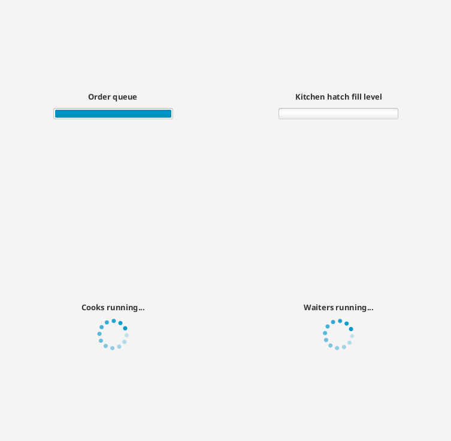
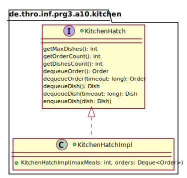
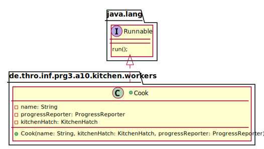
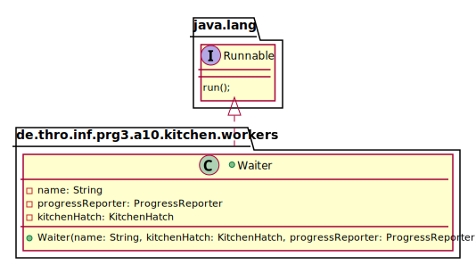

_This is an assignment to the class [Advanced Programming](https://hsro-inf-fpk.github.io) at the [University of Applied Sciences Rosenheim](http://www.th-rosenheim.de)._

# Assignment 10: Threads

This assignment covers the basics of multithreading in Java:

* `Runnable`
* `Thread`
* `synchronized`
* `wait()`, `notify()`, `notifyAll()`

You will implement a cook who prepares dishes and a waiter who is serving them to the guests.
These two components have to share data as the prepared dishes have to be available to the waiters.
To accomplish this you will implement a kitchen hatch where the cooks place the prepared dishes and the waiters can fetch them.

## Setup

1. Create a fork of this repository (button in the right upper corner)
2. Clone the project (get the link by clicking the green _Clone or download button_)
3. Import the project to your IntelliJ.

## Preview

The following image shows how the app looks like if you start it the first name.

The app contains the following controls:

1. a `ProgresBar` that indicates how many orders are left
2. a `ProgressBar` that indicates the remaining capacity of the `KitchenHatch`
3. a `ProgressIndicator` that indicates if there is at least one active cook left
4. a `ProgressIndicator` that indicates if there is at least one active waiter left

## Kitchen hatch

The following UML describes the already given interface `KitchenHatch` and the class `KitchenHatchImpl` you have to implement:

_Note that the UML is **not** complete! It's meant for orientation. You will need some more private fields._

1. Implement the given interface methods
2. The kitchen hatch is fixed sized to a discrete capacity. If the hatch is full the cooks have to wait until a waiter has removed (dequeued) a dish from the hatch.
3. If the kitchen hatch is empty a waiter has to wait because it does not know if the cooks are just lazy or if all orders are processed.
4. When all orders are completed the cooks can go home. The waiters can go home when all orders are completed **and** all dishes are served to the guests.
5. Use a `Deque<>` for storing the dishes (`Deque<>` is implemented by `LinkedList<>`). As you might know there are synchronized data structures like `BlockingQueue<>` in the JDK but in this assignment you should make your hands dirty and do the synchronization yourself to understand the concepts so don't use them.

## Threads - `Cook` and `Waiter`

### `Cook`

The following UML is meant as orientation how to implement the `Cook` class.

The class `Cook` has to implement the interface `Runnable` (which is already present in the JDK!) as every `Runnable` may be passed to a thread.

Furthermore a cook needs a reference to the `KitchenHatch` instance (to dequeue orders and to enqueue prepared dishes) and a reference to the `ProgressReporter` (more on this later).

In the `run()` method the cook has to dequeue orders until all orders are processed.
When an order is retrieved the cook hast to create a `Dish` and prepare it by waiting the required `cookingTime` by calling `Thread.sleep(dish.getCookingTime())`.

To display the progress call the method `updateProgress()` on the instance of `ProgressUpdater` at the end of your loop to ensure that the `OrderQueueProgress` is up-to-date.
The last statement in the `run()` method should be `progressReporter.notifyCookLeaving()`. This enables the `ProgressReporter` to remove the `KitchenBusyIndicator` when all `Cook` Threads are completed.

### `Waiter`

The following UML is meant as orientation how to implement the `Waiter` class.

The class `Waiter` has to implement the interface `Runnable` as well.
It also needs the same references as the cook to dequeue completed dishes and to update the UI.

In the `run()` method the waiter has to dequeue the completed dishes.
Afterwards the waiter has to serve the dish.
To simulate that call `Thread.sleep()` with a random time (between 0 and 1000ms).
When the dish is served update the UI by calling the `updateProgress()` method on the `ProgressReporter` instance.

The last call in the `run()` method, right before exiting, should be `progressReporter.notifyWaiterLeaving()` to enable the `ProgressReporter` to remove the `WaiterBusyIndicator` when all waiters are finished.

## Starting the threads

There are 2 **TODO** items in the `MainController` class:

At the first one you have to create an instance of your `KitchenHatchImpl` and assign it to the existing variable `kitchenHatch`.

At the second one you have to spawn the threads.
That means you have to create as many cooks and waiters as specified in the constants `COOKS_COUNT` and `WAITERS_COUNT` and pass each of them to a new `Thread` which can be started immediately.
Alternatively you can start them all at once by collecting them first in an `ArrayList<>` and iterating this list when you have created all threads.

## `ProgressReporter`

The class `ProgressReporter` is given.
It handles the interaction with the GUI elements mentioned above.
If you're using multithreading in graphical applications you have to take care which thread is accessing the graphical elements.
As this course is not meant to be an introduction to programming of graphical user interfaces (this is covered in the course GUI in the 4th semester) the required coding is already done and abstracted in the class `ProgressReporter`.

The class has 3 methods you have to use:

* `updateProgress()` called whenever a cook or waiter has completed one step to display the changes in the progress bars (`OrderQueueProgress` and `KitchenHatchProgress`)
* `notifyCookLeaving()` called whenever a cook thread is finished to enable the `ProgressReporter` to remove the `KitchenBusyIndicator` when all cooks are finished
* `notifyWaiterLeaving()` called whenever a waiter thread is finished to enable the `ProgressReporter` to remove the `WaiterBusyIndicator` when all waiters are finished.

